# Stundenlauf TS

Static-site TypeScript/React port of the Stundenlauf race-series management app. Runs entirely in the browser — no server, no native dependencies. Data lives in IndexedDB and can be exported/imported as JSON.

See `PROJECT_PLAN.md` for the full vision, requirements, and milestone roadmap.

## Kurzer Überblick: Ablauf in der Oberfläche

Die folgenden Screenshots entstehen automatisch mit dem Playwright-Test `e2e/readme-main-screen.spec.ts` und liegen unter `docs/readme/`. Sie zeigen einen typischen Weg von der Saisonverwaltung über den Excel-Import bis zur Auswertung.

**Saisonübersicht:** Nach dem Start siehst du die Liste bestehender Saisons und kannst Metadaten wie importierte Läufe einsehen.

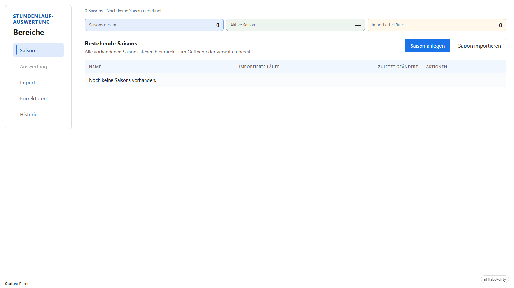

**Neue Saison anlegen:** Über „Saison anlegen“ öffnet sich der Dialog; dort gibst du den Saisonnamen ein und erstellst die Saison.

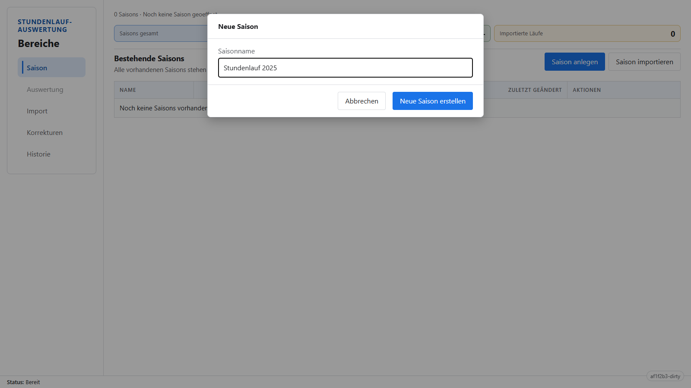

**Import:** Nach dem Anlegen landest du im Import-Tab. Hier wählst du Ergebnisdatei, Disziplin (Einzel/Paare) und den Lauf-Kontext, bevor du zu den Zuordnungen gehst.


**Datei gewählt:** Sobald eine passende Excel-Datei ausgewählt ist, wird die Auswahl zusammengefasst und „Weiter zu Zuordnungen“ wird aktiv.

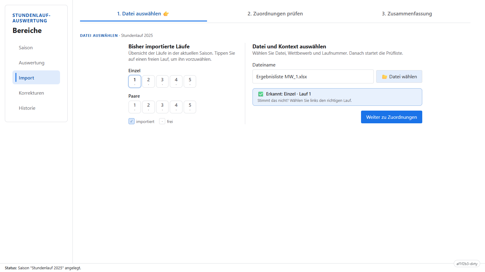

**Zuordnungen prüfen:** Im Review-Schritt vergleichst du importierte Zeilen mit bestehenden Teilnehmenden bzw. Teams und arbeitest die Vorschläge ab.

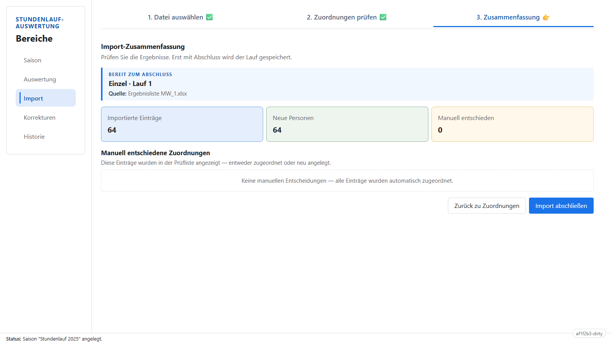

**Import abgeschlossen:** Nach „Import abschließen“ kehrst du zur Dateiauswahl zurück; die Saison enthält nun die importierten Ergebnisse.

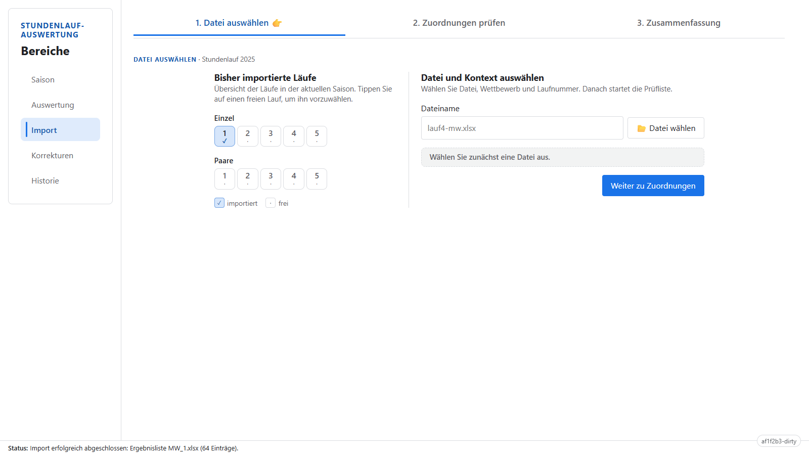

**Zweiter Lauf (Beispiel):** Für einen weiteren Meisterschaftslauf wählst du erneut eine Ergebnisliste — hier ein zweites Einzel-Workbook — und gehst wieder zu den Zuordnungen.

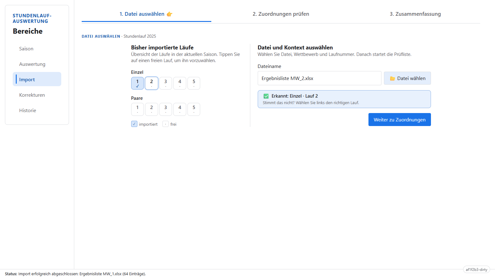

**Zuordnungen beim Folgeimport:** Beim zweiten Import tauchen oft Zuordnungen zu bereits bekannten Starterinnen/Startern auf; du prüfst und bestätigst die Vorschläge.

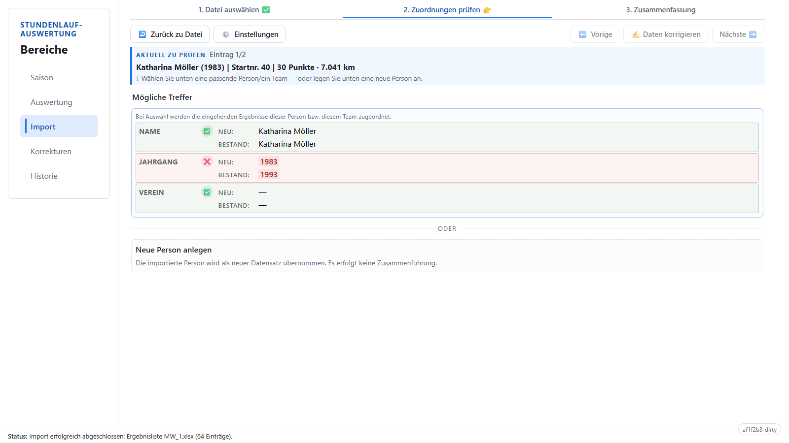

**Kandidat gewählt:** Ein Klick auf einen Merge-Kandidaten markiert die gewünschte Zuordnung, bevor du Daten korrigierst oder weiterklickst.

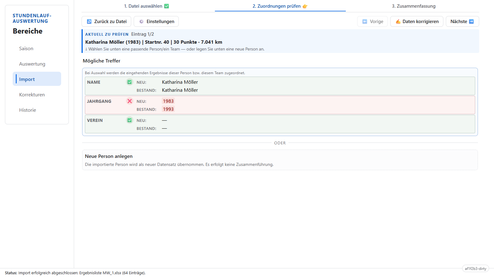

**Daten korrigieren:** Über „Daten korrigieren“ öffnet sich ein Dialog, in dem du Stammdaten (z. B. Name, Verein) anpassen kannst, ohne die Rohdatei zu ändern.

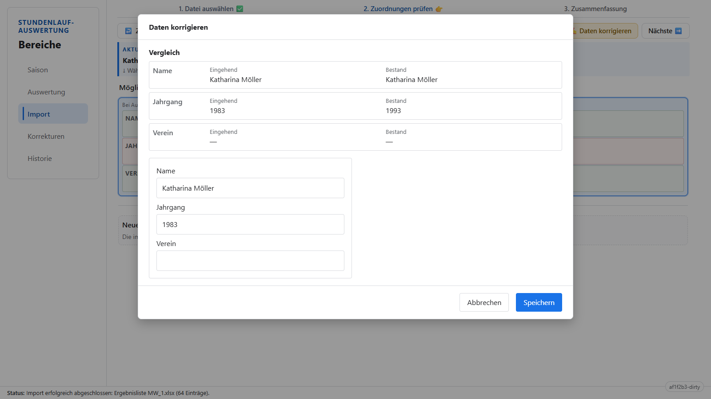

**Weiter im Review:** Nach dem Speichern schließt sich der Dialog; mit „Nächste“ arbeitest du die restlichen Review-Einträge ab.

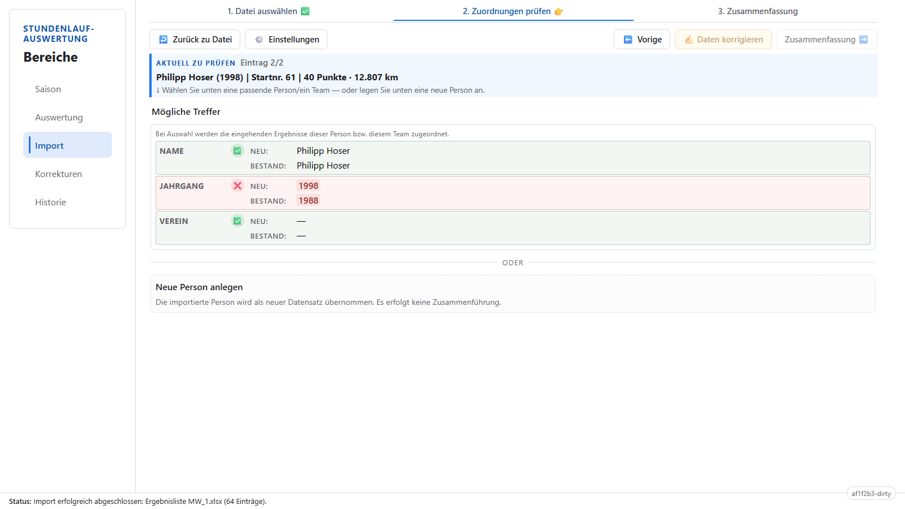

**Zusammenfassung:** Auf der Import-Zusammenfassung siehst du eine Übersicht der Änderungen, bevor du den Import endgültig abschließt.

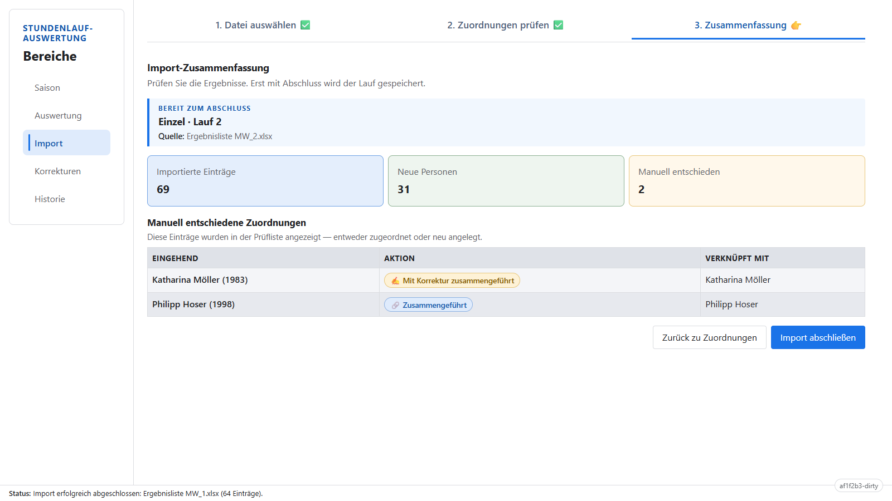

**Auswertung:** Unter „Auswertung“ erscheinen Gesamtwertung und Laufübersicht nach den importierten Ergebnissen und den Regeln der Serie.

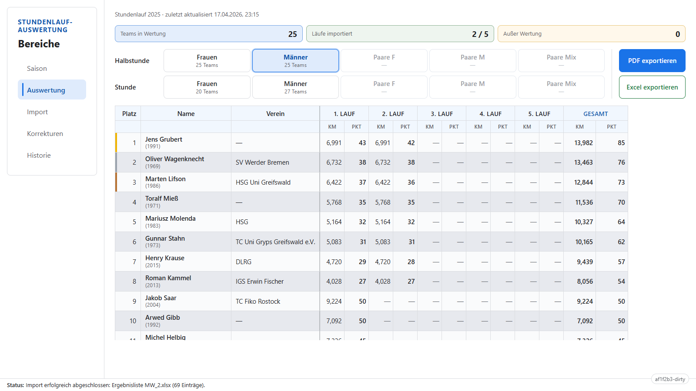

---

## Prerequisites

| Tool | Version | Notes |
|---|---|---|
| Node.js | LTS (v22+) | Only runtime dependency |
| pnpm | via Corepack | Package manager |

No other global tools required. All dev dependencies (TypeScript, Vite, ESLint, Vitest, Prettier) are project-local in `node_modules/`.

## Environment Setup

```bash
pnpm install
```

Verify everything works:

```bash
pnpm run typecheck   # TypeScript strict-mode check (no emit)
pnpm test            # Vitest test suite
pnpm run build       # Vite production build → dist/
```

## Development

```bash
pnpm run dev         # Vite dev server with HMR (http://localhost:5173)
```

## Available Scripts

| Script | Purpose |
|---|---|
| `pnpm run dev` | Start Vite dev server with hot module replacement |
| `pnpm run build` | Typecheck + production build to `dist/` |
| `pnpm run preview` | Serve the production build locally |
| `pnpm test` | Run Vitest test suite (single run) |
| `pnpm run test:watch` | Run Vitest in watch mode |
| `pnpm run test:coverage` | Run tests with coverage report |
| `pnpm run typecheck` | TypeScript type checking (`tsc --noEmit`) |
| `pnpm run lint` | ESLint check on `src/` and `tests/` |
| `pnpm run lint:fix` | ESLint auto-fix |
| `pnpm run format` | Prettier format all source files |
| `pnpm run format:check` | Prettier check (CI-friendly, no writes) |
| `pnpm run inspect:excel-fixtures` | Plain-text parse report for local `.xlsx` under `tests/data/xlsx/` (see below) |

### Manual Excel parse dump (local fixtures)

Place organizer workbooks under `tests/data/xlsx/` in any subdirectory (recursive). Files are not committed: the repo root `.gitignore` ignores `*.xlsx`.

From the repository root:

```bash
pnpm run inspect:excel-fixtures
```

Capture output to a file (still run from the package directory):

```bash
pnpm run inspect:excel-fixtures > excel-dump.txt
```

The script prints **ASCII separators** so the file stays readable if an editor assumes a legacy Windows code page. Names and clubs from the sheet are still UTF-8; open `excel-dump.txt` as **UTF-8** in your editor (VS Code does this by default). On Windows PowerShell, you can also use:

```powershell
pnpm run inspect:excel-fixtures | Out-File -Encoding utf8 excel-dump.txt
```

Optional Vitest integration tests for the same tree are in `tests/ingestion/local-excel-examples.test.ts` (skipped when no matching files are present).

## Technology Stack

| Layer | Library | Version |
|---|---|---|
| Language | TypeScript | ~5.8 (strict mode, ES2022 target) |
| UI Framework | React | ^19 |
| State Management | Zustand | ^5 |
| Build | Vite | ^6 |
| Testing | Vitest + @testing-library/react | ^3 / ^16 |
| Linting | ESLint (flat config) + Prettier | ^9 / ^3 |

## Folder Structure

```
./
├── docs/                              # Feature plans and accomplishments
│   ├── ACCOMPLISHMENTS.md
│   └── features/                      # Per-feature design docs (F-TS01..F-TS09)
├── PROJECT_PLAN.md                    # Vision, requirements, milestones
├── README.md                          # This file
│
├── package.json                       # Dependencies and scripts
├── tsconfig.json                      # TypeScript config (strict, ES2022)
├── tsconfig.node.json                 # TS config for build tooling files
├── vite.config.ts                     # Vite build configuration
├── vitest.config.ts                   # Vitest test runner configuration
├── eslint.config.ts                   # ESLint flat config (strict TS rules)
├── .prettierrc                        # Prettier formatting rules
├── index.html                         # Vite entry HTML
│
├── src/                               # Application source
│   ├── main.tsx                       # React entry point (mounts App)
│   ├── App.tsx                        # App shell: header, tabs, routing, status
│   ├── strings.ts                     # German string catalog (typed)
│   ├── format.ts                      # Display formatting (formatKm, etc.)
│   ├── theme.css                      # CSS custom properties / design tokens
│   ├── vite-env.d.ts                  # Vite client type declarations
│   │
│   ├── domain/                        # Event-sourced core (F-TS01) — framework-agnostic
│   │   ├── types.ts                   # Domain value types, enums, projected state
│   │   ├── events.ts                  # Event envelope + payload type definitions
│   │   ├── projection.ts             # projectState / applyEvent (pure fold)
│   │   ├── validation.ts             # Per-event-type validation rules
│   │   └── workspace.ts              # Season lifecycle (create/delete/reset/import)
│   │
│   ├── storage/                       # IndexedDB persistence (F-TS01 §7)
│   │   ├── db.ts                      # Database schema and setup
│   │   └── event-store.ts            # Event log read/write/append
│   │
│   ├── matching/                      # Fuzzy matching engine (F-TS03)
│   │   ├── fingerprint.ts            # Identity fingerprinting
│   │   ├── scoring.ts                # Candidate scoring functions
│   │   └── workflow.ts               # Match resolution workflow
│   │
│   ├── ranking/                       # Standings computation (F-TS04)
│   │   └── engine.ts                 # stundenlauf_v1 ruleset
│   │
│   ├── import/                        # Import orchestration (F-TS02, F-TS05)
│   │   ├── parser.ts                 # Client-side Excel/CSV parsing
│   │   └── orchestrator.ts           # parse → validate → match → review → emit
│   │
│   ├── export/                        # Export generation (F-TS08)
│   │   ├── pdf.ts                    # jsPDF + AutoTable standings PDF
│   │   └── excel.ts                  # ExcelJS standings .xlsx
│   │
│   ├── stores/                        # Zustand reactive UI stores
│   │   ├── season.ts                 # Active season, overview data
│   │   ├── standings.ts              # Selected category, correction/merge mode
│   │   ├── import.ts                 # Import draft, review queue, matching config
│   │   └── status.ts                 # Global status/toast messages
│   │
│   ├── components/                    # React components
│   │   ├── shared/                   # Cross-screen reusable components
│   │   │   ├── ConfirmModal.tsx      # Styled modal (replaces window.confirm)
│   │   │   ├── StatusBar.tsx         # Global status bar
│   │   │   ├── ImportedRunsMatrix.tsx # Race import coverage grid
│   │   │   └── CategoryGrid.tsx      # Einzel/Paare quick-select
│   │   │
│   │   ├── season/                   # Season management screen
│   │   │   └── SeasonEntryView.tsx   # List, create, open, delete, export, import
│   │   │
│   │   ├── standings/                # Standings screen
│   │   │   ├── StandingsView.tsx     # Layout: sidebar + content
│   │   │   ├── StandingsTable.tsx    # Gesamtwertung table
│   │   │   ├── PerRaceTable.tsx      # Laufübersicht with race columns
│   │   │   ├── IdentityModal.tsx     # Participant/team data correction
│   │   │   └── MergePanel.tsx        # Duplicate merge workflow
│   │   │
│   │   ├── import/                   # Import screen
│   │   │   ├── ImportView.tsx        # Layout: controls + review panel
│   │   │   ├── ImportControls.tsx    # File input, type toggle, race select
│   │   │   ├── MatchingSettings.tsx  # Mode tabs, threshold sliders
│   │   │   ├── ReviewPanel.tsx       # Review queue display
│   │   │   ├── ReviewTable.tsx       # Candidate rows with diff highlighting
│   │   │   └── MergeCorrectModal.tsx # Side-by-side compare + edit
│   │   │
│   │   └── history/                  # History screen
│   │       ├── HistoryView.tsx       # Layout: imports + audit trail
│   │       ├── ImportHistoryTable.tsx # Grouped imports with rollback
│   │       └── AuditTrailTable.tsx   # Correction/merge audit entries
│   │
│   └── lib/                          # Shared pure utilities
│       ├── escape-html.ts            # HTML entity escaping
│       └── normalization.ts          # Name/club normalization
│
├── scripts/                           # Dev-only CLI helpers (vite-node)
│   └── dump-local-excel-fixtures.ts   # inspect:excel-fixtures
│
└── tests/                             # Test suite (mirrors src/ structure)
    ├── data/xlsx/                     # Local .xlsx fixtures (gitignored; optional tests + manual dump)
    ├── setup.ts                       # Vitest global setup (jest-dom matchers)
    ├── domain/
    │   ├── projection.test.ts         # Projection / fold tests
    │   └── validation.test.ts         # Event validation tests
    ├── lib/
    │   └── escape-html.test.ts        # Utility tests
    └── format.test.ts                 # Formatting utility tests
```

### Architecture at a Glance

- **`src/domain/`** — Pure TypeScript, no framework imports. All domain logic (types, events, projection, validation) lives here. Testable in isolation.
- **`src/storage/`** — IndexedDB adapter. The only module with browser API side effects.
- **`src/matching/`**, **`src/ranking/`**, **`src/import/`**, **`src/export/`** — Feature modules that consume domain types. Each maps to a feature plan in `docs/features/`.
- **`src/stores/`** — Zustand stores bridge domain state to React. Components subscribe via hooks with selectors for minimal re-renders.
- **`src/components/`** — React components organized by screen. Shared components live in `shared/`.
- **`src/lib/`** — Small pure utility functions with no domain or framework dependencies.

### Key Design Decisions

1. **Domain logic is framework-agnostic** — `src/domain/` has zero React imports. This makes the event-sourced core independently testable and portable.
2. **Feature modules map to feature plans** — each subdirectory under `src/` corresponds to one or more `F-TS*` feature documents in `docs/features/`.
3. **Tests mirror source** — `tests/domain/` tests `src/domain/`, etc. Co-located `*.test.ts` files in `src/` are also supported by the Vitest config.
4. **Path alias** — `@/` maps to `src/` for clean imports (configured in both `tsconfig.json` and `vite.config.ts`).
