# Stundenlauf TS

Static-site TypeScript/React port of the Stundenlauf race-series management app. Runs entirely in the browser without an application backend. Season data lives in browser-local IndexedDB; backups are `.stundenlauf-season.zip` archives containing a manifest and event log.

See [PROJECT_PLAN.md](PROJECT_PLAN.md) for the vision, requirements and milestone roadmap. The [dependency and platform refresh workplan](docs/workplans/2026-10-dependency-and-platform-refresh.md) records selected versions, independent reviews, Linux/Windows checks, advisory decisions and pending external acceptance.

## Kurzer Überblick: Ablauf in der Oberfläche

Die folgenden Screenshots entstehen automatisch mit dem Playwright-Test `e2e/readme-main-screen.spec.ts` und liegen unter `docs/readme/`. Sie zeigen einen typischen Weg von der Saisonverwaltung über den Excel-Import bis zur Auswertung.

**Saisonübersicht:** Nach dem Start siehst du die Liste bestehender Saisons und kannst Metadaten wie importierte Läufe einsehen.

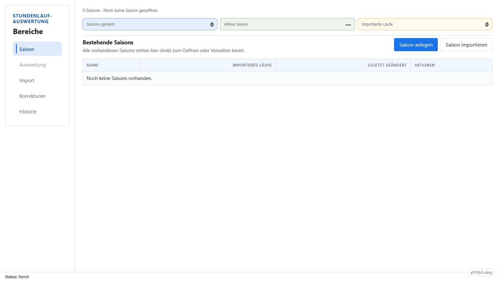

**Neue Saison anlegen:** Über „Saison anlegen“ öffnet sich der Dialog; dort gibst du den Saisonnamen ein und erstellst die Saison.

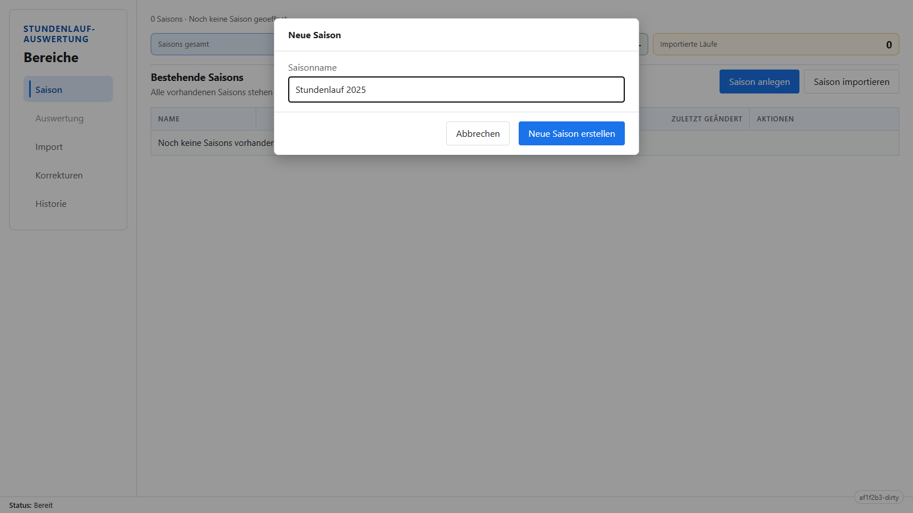

**Import:** Nach dem Anlegen landest du im Import-Tab. Hier wählst du Ergebnisdatei, Disziplin (Einzel/Paare) und den Lauf-Kontext, bevor du zu den Zuordnungen gehst.


**Datei gewählt:** Sobald eine passende Excel-Datei ausgewählt ist, wird die Auswahl zusammengefasst und „Weiter zu Zuordnungen“ wird aktiv.

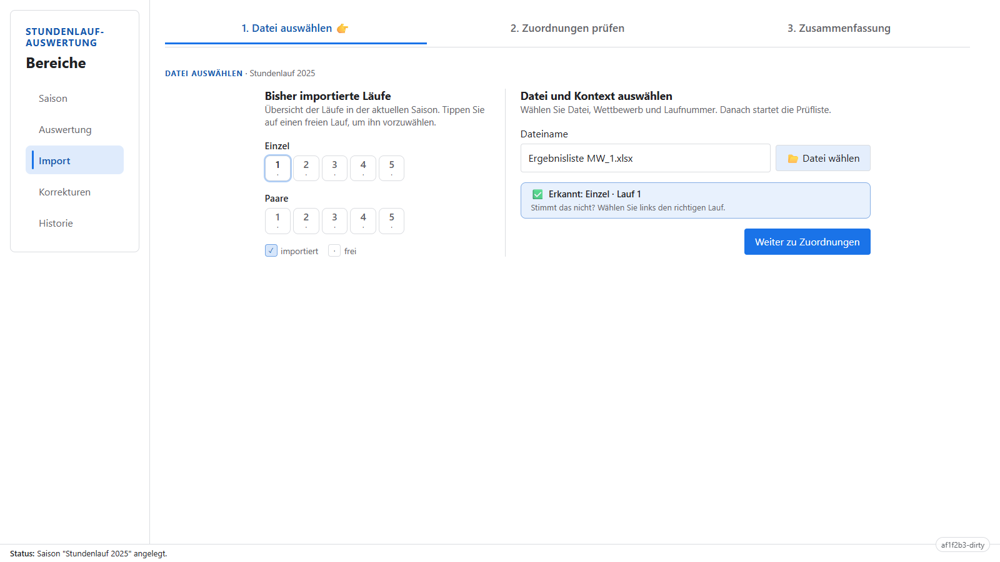

**Zuordnungen prüfen:** Im Review-Schritt vergleichst du importierte Zeilen mit bestehenden Teilnehmenden bzw. Teams und arbeitest die Vorschläge ab.

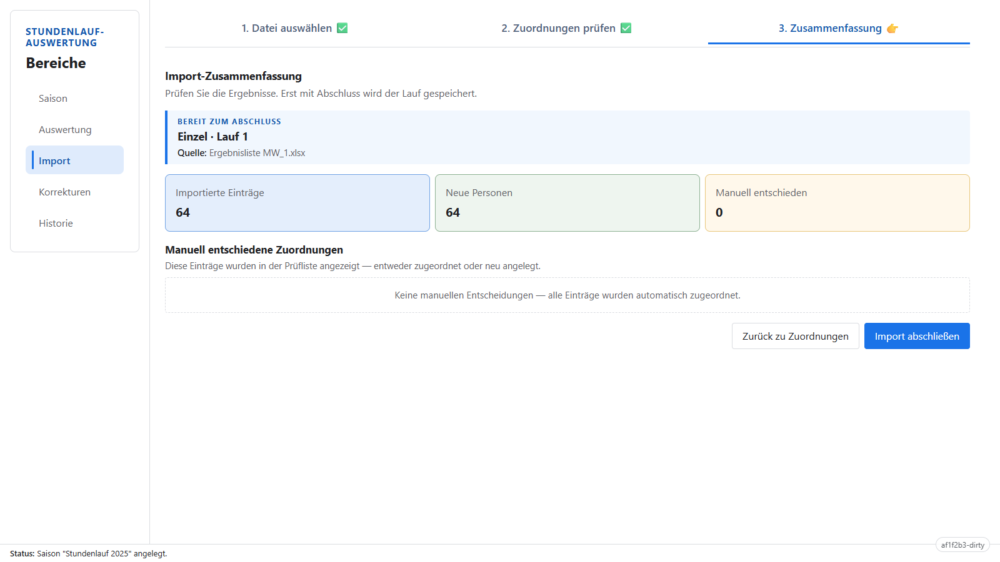

**Import abgeschlossen:** Nach „Import abschließen“ kehrst du zur Dateiauswahl zurück; die Saison enthält nun die importierten Ergebnisse.

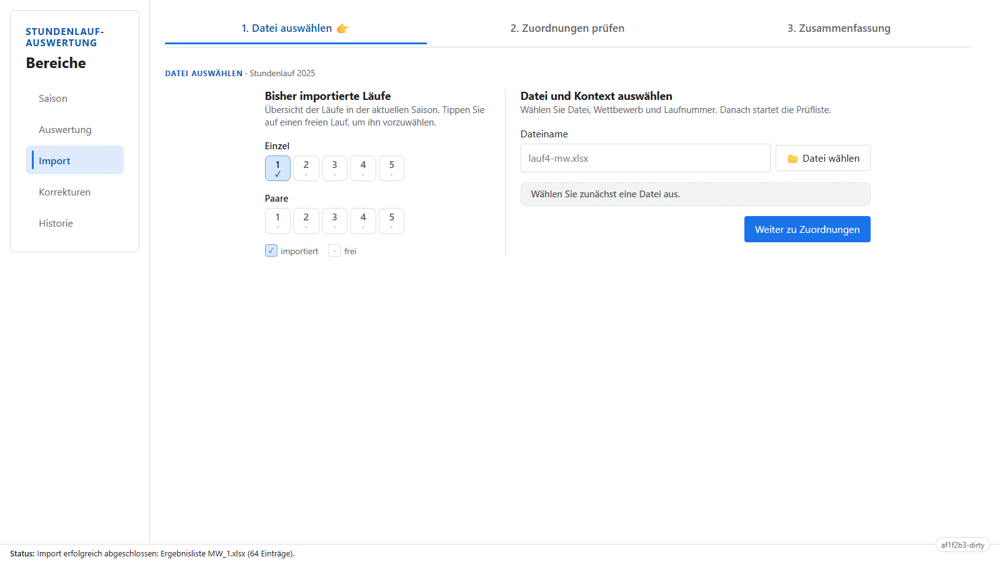

**Zweiter Lauf (Beispiel):** Für einen weiteren Meisterschaftslauf wählst du erneut eine Ergebnisliste — hier ein zweites Einzel-Workbook — und gehst wieder zu den Zuordnungen.

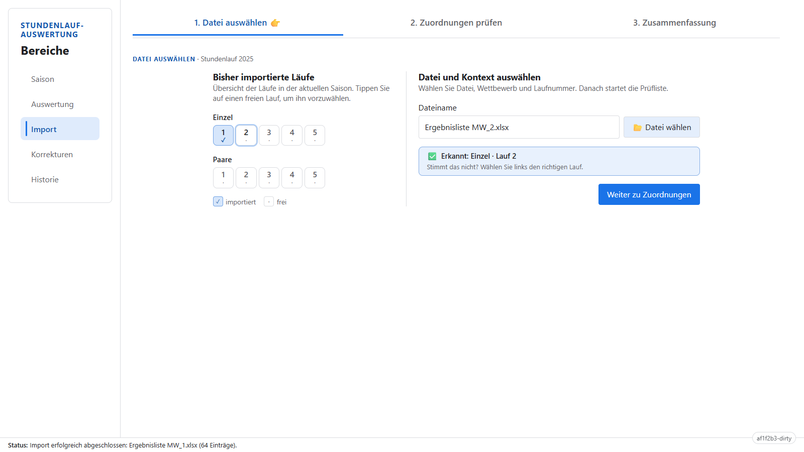

**Zuordnungen beim Folgeimport:** Beim zweiten Import tauchen oft Zuordnungen zu bereits bekannten Starterinnen/Startern auf; du prüfst und bestätigst die Vorschläge.

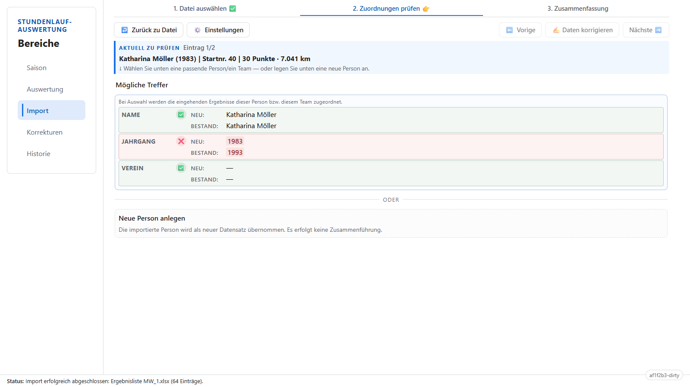

**Kandidat gewählt:** Ein Klick auf einen Merge-Kandidaten markiert die gewünschte Zuordnung, bevor du Daten korrigierst oder weiterklickst.

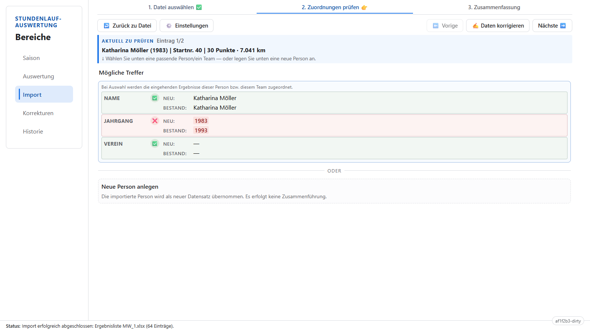

**Daten korrigieren:** Über „Daten korrigieren“ öffnet sich ein Dialog, in dem du Stammdaten (z. B. Name, Verein) anpassen kannst, ohne die Rohdatei zu ändern.

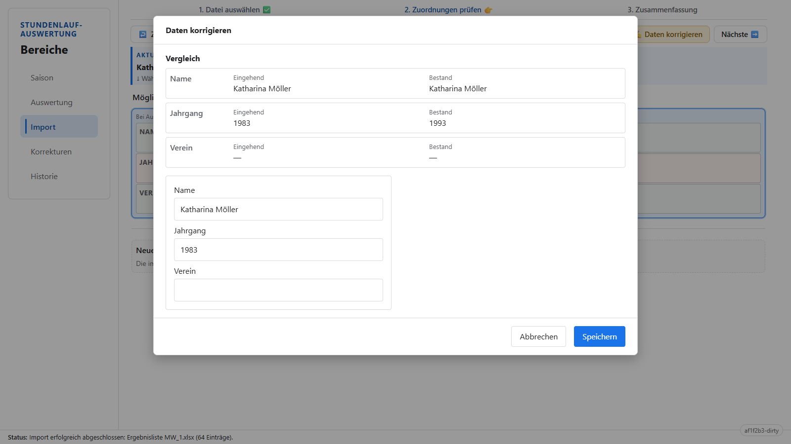

**Weiter im Review:** Nach dem Speichern schließt sich der Dialog; mit „Nächste“ arbeitest du die restlichen Review-Einträge ab.

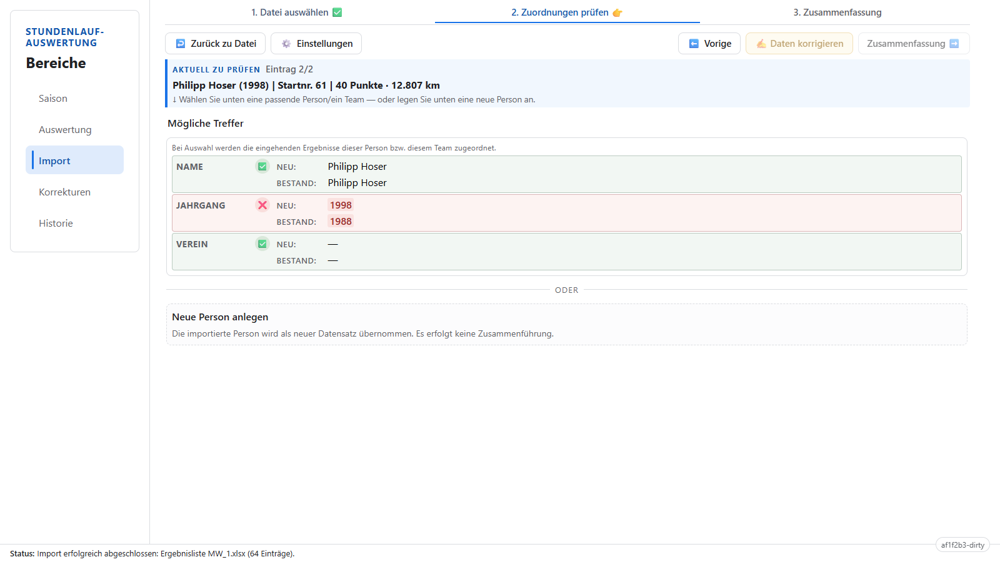

**Zusammenfassung:** Auf der Import-Zusammenfassung siehst du eine Übersicht der Änderungen, bevor du den Import endgültig abschließt.

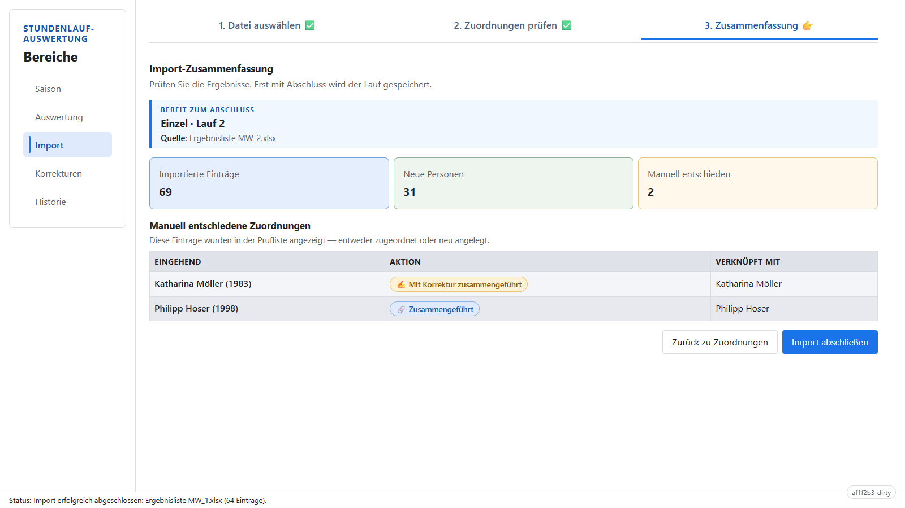

**Auswertung:** Unter „Auswertung“ erscheinen Gesamtwertung und Laufübersicht nach den importierten Ergebnissen und den Regeln der Serie.

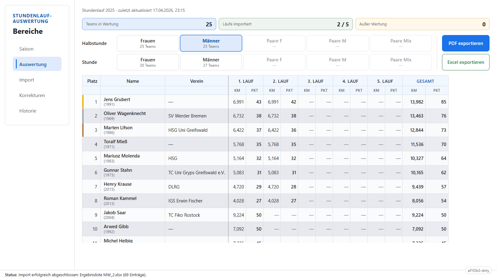

---

## Prerequisites

| Tool | Version | Notes |
|---|---|---|
| Node.js | 24.21.0 LTS | `.node-version` and `.nvmrc`; engines require `>=24.21.0 <25` |
| pnpm | 10.34.6 via Corepack | Exact `packageManager` pin; pnpm 11/12 await verified Dependabot support |
| Browser for automated smoke tests | Playwright's bundled Chromium | Installed through the repository's Playwright version on Linux and Windows |

Development tools are project-local in `node_modules/`. Linux browser tests also need the system libraries installed by Playwright's `--with-deps` command.

## Environment Setup

Install Node 24.21.0 with your platform's Node version manager (`nvm use` on Linux reads `.nvmrc`; on Windows select 24.21.0 explicitly). Enable Corepack once for that Node installation, then use the repository pin:

```bash
corepack enable
corepack pnpm --version  # 10.34.6
pnpm install --frozen-lockfile
```

These commands work in Bash and PowerShell. Normal installation permits esbuild setup and runs the root `prepare` script to install the pre-push quality hook. Dependency-level core-js and simple-git-hooks scripts are explicitly disabled; root hook setup remains enabled. Text files use LF; `.cmd`/`.bat` use CRLF when present. Engine and peer requirements are enforced during installation.

Install the matching bundled browser on Linux:

```bash
pnpm exec playwright install --with-deps chromium
```

On Windows, use:

```powershell
pnpm exec playwright install chromium
```

System Chrome is not required for the production smoke tests. Re-run browser installation after updating Playwright.

Run the complete local quality gate:

```bash
pnpm run ci:local
```

This is also the pre-push hook. It performs a frozen install, formatting, strict lint and no-emit type checks, tests with coverage and source-scope verification, a production build, lint again after build, the optional fixture CLI and production browser smoke tests. Browser installation is a prerequisite; the gate does not install system libraries on each run.

## Development

```bash
pnpm run dev         # Vite dev server with HMR (http://localhost:5173)
```

## Available Scripts

| Script | Purpose |
|---|---|
| `pnpm run dev` | Start Vite with hot module replacement |
| `pnpm run build` | Strict no-emit type checks, then production build to `dist/` |
| `pnpm run preview` | Serve `dist/` locally at the configured Pages subpath |
| `pnpm run ci:local` | Frozen install and all quality/build/browser gates; also the pre-push hook |
| `pnpm test` | Run unit/integration tests once |
| `pnpm run test:watch` | Run Vitest in watch mode |
| `pnpm run test:coverage` | Tests with coverage thresholds, followed by application source-scope verification |
| `pnpm run test:smoke` | Fixture-independent production browser, archive/export and PWA checks |
| `pnpm run playwright:install` | Install the matching bundled Chromium; Linux system libraries use the setup command above |
| `pnpm run screenshots:readme` | Optional organizer-fixture workflow that regenerates `docs/readme/` images |
| `pnpm run typecheck` | Strict no-emit checks for app/tests and scripts/e2e/root tooling configs |
| `pnpm run lint` | Typed ESLint for src/tests/scripts/e2e and root configs |
| `pnpm run lint:fix` | ESLint auto-fix |
| `pnpm run format` | Prettier for src/tests/scripts/e2e and root TS configs |
| `pnpm run format:check` | Check that formatting scope without writes |
| `pnpm run inspect:excel-fixtures` | Parse report for optional local `.xlsx` files under `tests/data/xlsx/` |

### Production browser checks

```bash
pnpm run test:smoke
```

The dedicated smoke suite builds and serves actual production output at `/stundenlauf-ts/`. It creates synthetic workbooks in memory, creates a season, exercises import review/finalization and standings, checks persistence after reload, validates XLSX/PDF result contents, and restores a downloaded season archive into an empty target season. It also checks real service-worker activation, offline startup and the update prompt across two controlled production builds, comparing season events before and after the update.

The suite needs no organizer files and does not regenerate README images. Failure traces/screenshots are kept under `test-results/` and `playwright-report/`; CI retains OS-specific failure artifacts. Production builds used by this suite go into temporary directories.

The automated browser matrix covers Playwright 1.63.0's bundled Chromium, revision 1243 / Chrome 153.0.8010.12, on Linux and Windows. Firefox, Safari, Edge and desktop spreadsheet applications have separate acceptance needs. Vite 8's default syntax targets (Chrome/Edge 111, Firefox 114, Safari 16.4) describe generated code, not a runtime test matrix or a guarantee that every browser at those versions supports the app.

README screenshot generation is optional and separate:

```bash
pnpm run screenshots:readme
```

It requires `tests/data/xlsx/Ergebnisliste MW_1.xlsx` and `tests/data/xlsx/Ergebnisliste MW_2.xlsx` and intentionally overwrites `docs/readme/` images. It is excluded from the production smoke command and CI quality gates.

### Move an existing season to another browser or checkout

A Git checkout contains application code; it does not contain the seasons stored in another browser profile's IndexedDB. Browser storage belongs to the profile and origin, so a different local URL or deployed origin has separate data.

1. In the original browser/profile and app origin, export each season using its season-backup action. Keep the resulting `.stundenlauf-season.zip` files; the current UI labels this action “Datensicherung”.
2. Open the updated app in the target browser/profile. Create an empty target season with the desired name, or select an existing empty target season through “Öffnen”.
3. Return to “Saison” and use “Saison importieren” to choose the archive. Import replaces the selected target season's event log and keeps that target's name/identity; select an empty season to preserve any other season's data.
4. Reload, open the restored season and verify its imported runs, standings and history. Retain the original browser data and backup until those checks pass.

Synthetic archive round trips are automated. Acceptance of an existing organizer season archive remains pending in WP-12; a successful synthetic round trip does not establish compatibility with an unavailable historical archive.

### Manual Excel parse dump (local fixtures)

Place organizer workbooks under `tests/data/xlsx/` in any subdirectory (recursive). Files are not committed: the repo root `.gitignore` ignores `*.xlsx`.

From the repository root:

```bash
pnpm run inspect:excel-fixtures
```

Capture output to a file (still run from the package directory):

```bash
pnpm run inspect:excel-fixtures > excel-dump.txt
```

The script prints **ASCII separators** so the file stays readable if an editor assumes a legacy Windows code page. Names and clubs from the sheet are still UTF-8; open `excel-dump.txt` as **UTF-8** in your editor (VS Code does this by default). On Windows PowerShell, you can also use:

```powershell
pnpm run inspect:excel-fixtures | Out-File -Encoding utf8 excel-dump.txt
```

Optional Vitest integration tests for the same tree are in `tests/ingestion/local-excel-examples.test.ts` (skipped when no matching files are present).

### Spreadsheet dependency maintenance

Imports use SheetJS CE 0.20.3 from its [official versioned tarball](https://cdn.sheetjs.com/xlsx-0.20.3/xlsx-0.20.3.tgz), with integrity in `pnpm-lock.yaml`. The npm registry's `xlsx` release is outdated. The repository maintainer checks the [official installation page](https://docs.sheetjs.com/docs/getting-started/installation/nodejs/) and [upstream releases](https://git.sheetjs.com/sheetjs/sheetjs/tags) quarterly and whenever an import advisory appears. This is a manual procedure; no recurring job is configured.

Before updating, verify the source, package version/license, archive integrity, Node requirements and migration guidance. Update the versioned URL through the dependency coordinator, run a normal frozen install on Linux and Windows, then run ingestion/API, export/archive tests and the full quality/browser gates. Record full/production audits and residual dispositions in the [maintenance workplan](docs/workplans/2026-10-dependency-and-platform-refresh.md). Organizer workbooks and Excel/LibreOffice acceptance remain a separate check when those inputs are available.

ExcelJS 4.4.0 remains the export library and latest official stable release at this refresh. Its UUID advisory has a reviewed applicability disposition in the workplan; review again at the next dependency refresh, an ExcelJS release/backport, or a change to conditional formatting/UUID use. Do not force incompatible transitive majors to clear audit output.

### Dependency automation and acceptance

Dependabot is configured for pnpm through the `npm` ecosystem and for GitHub Actions, with weekly Monday checks at 06:00 Europe/Berlin and PR limits of five and three. React packages and Vitest/coverage update together; build/lint major migrations have separate groups. Automatic merging is not configured. Review dependency PRs with frozen installation and both Linux/Windows quality jobs.

The repository's dependency graph, vulnerability alerts and security updates were verified active during this refresh. An actual version-update job using the new configuration and a representative generated PR's manifest/lockfile and quality checks remain pending until the configuration is active on the default branch. Repository maintainers own those checks. SheetJS's pinned CDN release continues to use the manual procedure above.

The inspected main ruleset prevents deletion and force pushes; it does not currently enforce required status checks. Reviewers must confirm both quality jobs pass before merging. The refresh preserves the existing branch policy.

The [workplan](docs/workplans/2026-10-dependency-and-platform-refresh.md) records full and production audits and the remaining ExcelJS → UUID 8.3.2 moderate advisory. That residual has a reviewed applicability decision, owner and review triggers; audit commands may still report it. TypeScript 7 remains deferred because typescript-eslint 8.71.0 supports compiler versions below 6.1. Reassess that holdback when upstream support changes.

Dependabot's three-day cooldown can reject newly reviewed versions already present in the lockfile during an unrelated update. The temporary `minimumReleaseAgeExclude` entries in `pnpm-workspace.yaml` name only exact reviewed releases; future versions remain subject to that cooldown. Remove these entries after 2026-10-06 14:14 UTC, when every listed release is older than three days. Node-types major updates require a coordinated runtime-major review; their minor and patch updates remain enabled.

Organizer workbooks, agreed reference outcomes, an existing season archive, and Windows Excel/Linux LibreOffice application acceptance are tracked separately as **WP-12: Awaiting Fixtures**. The automated Linux/Windows browser checks use synthetic inputs.

## Technology Stack

Versions below are the resolved versions validated for this refresh; compatible manifest ranges and artifact integrity are recorded in `package.json` and `pnpm-lock.yaml`.

| Layer | Library | Validated version |
|---|---|---|
| Language | TypeScript | 6.0.3; strict mode, ES2022 compiler target |
| UI | React / ReactDOM | 19.3.0 |
| State | Zustand | 5.0.15 |
| Build | Vite / React plugin | 8.3.2 / 6.1.1; Rolldown |
| PWA | vite-plugin-pwa / Workbox | 2.0.0 / 7.4.1 |
| Import | SheetJS CE | 0.20.3; official versioned CDN artifact |
| Spreadsheet export | ExcelJS | 4.4.0 |
| Unit/integration tests | Vitest / coverage-v8 / jsdom | 5.0.3 / 5.0.3 / 30.1.1 |
| Component tests | Testing Library React / jest-dom | 16.3.3 / 7.0.1 |
| Browser tests | Playwright | 1.63.0; bundled Chromium |
| Lint | ESLint / typescript-eslint / globals | 10.12.0 / 8.71.0 / 17.13.0 |
| Format | Prettier | 3.9.9 |
| Fixture/coverage CLI | TSX | 4.23.15; directly declared |

## Folder Structure

```text
./
├── .github/
│   ├── dependabot.yml                 # pnpm and Actions update groups/schedule
│   └── workflows/ts-deploy.yml        # Linux/Windows quality; main-only Pages deployment
├── .node-version / .nvmrc             # Node 24.21.0
├── .npmrc                            # Engine/package-manager/peer enforcement
├── .gitattributes                    # Cross-platform line-ending rules
├── package.json / pnpm-lock.yaml      # Declared tools/scripts and frozen resolutions
├── pnpm-workspace.yaml               # Explicit dependency build-script policy
├── tsconfig.json                     # Strict no-emit app and test checks
├── tsconfig.node.json                # Strict no-emit scripts/e2e/root-config checks
├── vite.config.ts                    # Canonical production/PWA config and Pages base
├── vitest.config.ts                  # Unit config, coverage scope and thresholds
├── eslint.config.ts                  # Canonical strict typed flat config
├── playwright.config.ts              # Optional README screenshot workflow
├── playwright.smoke.config.ts        # Dedicated bundled-Chromium production smoke
├── src/
│   ├── main.tsx                      # Browser entry point
│   ├── app/                          # App shell, routing, German strings/format/theme
│   ├── api/                          # AppApi contracts, provider and live/mock implementations
│   ├── features/                     # Season/import/standings/history/corrections screens
│   ├── components/                   # Reusable layout, tables and feedback/PWA components
│   ├── domain/                       # Framework-independent events/projection/validation
│   ├── storage/                      # IndexedDB event-log persistence and serialization
│   ├── services/                     # Season repository boundary
│   ├── ingestion/                    # SheetJS workbook/singles/couples parsing
│   ├── import/                       # Parse → validate → match → review → finalize orchestration
│   ├── matching/ / ranking/           # Identity matching and derived standings
│   ├── export/                       # ExcelJS/jsPDF result generation
│   ├── portability/                  # Season ZIP manifest, checksum, export/import
│   ├── stores/                       # Zustand UI/application stores
│   ├── devtools/                     # Development-only harnesses
│   └── lib/                          # Shared pure utilities
├── scripts/
│   ├── dump-local-excel-fixtures.ts   # Direct TSX fixture CLI
│   └── check-coverage-scope.ts        # Reject missing application sources in LCOV
├── tests/                            # Unit/integration tests mirroring source behavior
│   ├── setup.ts                      # Shared jest-dom setup and React act-warning guard
│   ├── mocks/                        # Typed unit-only virtual PWA module
│   ├── build/                        # Entry/config/lazy-loading/coverage-scope checks
│   └── data/xlsx/                    # Optional private workbooks; gitignored
├── e2e/
│   ├── production-smoke.spec.ts       # Fixture-independent production/persistence/export/PWA checks
│   ├── helpers/                      # Synthetic inputs, content validation, temporary production server
│   └── readme-main-screen.spec.ts     # Optional organizer-only screenshot workflow
├── docs/
│   ├── ACCOMPLISHMENTS.md
│   ├── features/ / hardening/         # Feature and reliability plans
│   ├── workplans/                    # Maintenance decisions, review and verification record
│   └── readme/                       # Committed workflow screenshots
├── PROJECT_PLAN.md
└── README.md
```

### Architecture at a Glance

- **`src/domain/`** — Framework-independent event types, projection, validation and lifecycle rules.
- **`src/storage/`**, **`src/services/`** — IndexedDB persistence and season repository access. **`src/portability/`** handles archive migration through files.
- **`src/ingestion/`**, **`src/import/`**, **`src/matching/`**, **`src/ranking/`**, **`src/export/`** — Parsing, import orchestration, identity resolution, standings and result generation over domain types.
- **`src/api/`** — The typed AppApi boundary between screens and application operations, with live and mock implementations.
- **`src/app/`**, **`src/features/`**, **`src/components/`**, **`src/stores/`** — Routing/shell, workflow screens, reusable UI and Zustand state.
- **`scripts/`**, **`tests/`**, **`e2e/`** — Developer CLIs, unit/integration checks and dedicated production browser checks. Root TS configs are authoritative; type checks do not regenerate adjacent JS/declaration files.

Coverage thresholds remain 50% for lines/statements/functions and 45% for branches. The coverage command also verifies that every expected application `.ts`/`.tsx` source is present in LCOV (118 files at this refresh, excluding the browser entry, declarations and co-located test modules). This inventory is derived from the source tree rather than a fixed file-count threshold. Vitest 5's instrumentation differs from the previous provider; detailed counter/scope evidence is in the workplan.

### Key Design Decisions

1. **Domain logic is framework-agnostic** — `src/domain/` has zero React imports. This makes the event-sourced core independently testable and portable.
2. **Feature modules map to feature plans** — each subdirectory under `src/` corresponds to one or more `F-TS*` feature documents in `docs/features/`.
3. **Tests mirror source** — `tests/domain/` tests `src/domain/`, etc. The canonical Vitest config selects `tests/**/*.test.{ts,tsx}` and co-located `src/**/*.test.{ts,tsx}`. Test modules are excluded from application coverage; production browser tests use their dedicated Playwright config.
4. **Path alias** — `@/` maps to `src/` for clean imports (configured in TypeScript and the canonical Vite/Vitest configs; the direct TSX fixture runner also resolves it).
